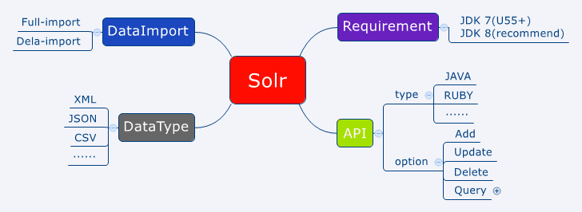

#solr Guide

Note: this guide write on Solr-5.0.0.

##Solr Architecture

##Install Guide

[Download Solr-5.0.0](http://archive.apache.org/dist/lucene/solr/5.0.0/solr-5.0.0.zip)

after unzip the package,then run:
>cd solr-5.0.0

on Unix:
>bin/solr start

on Windows:
>bin/solr.cmd start

then you can access solr server from : [http://localhost:8983/solr](http://localhost:8983/solr)

To be continue......